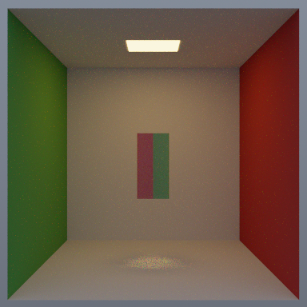
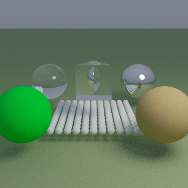
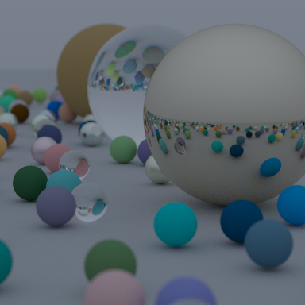

# PathTracer Spectral

A personal, experimental project: A high-performance spectral path tracer implemented with CUDA that accurately simulates light dispersion effects and spectral rendering in real-time. This is a passion project created to explore the physics of light and GPU-accelerated rendering techniques.

## Features

- **Physically-Based Spectral Rendering**: Simulates light wavelengths between 380nm and 780nm for accurate dispersion and color effects
- **CUDA-Accelerated Computation**: Leverages GPU parallel processing for optimal performance
- **Realistic Material System**:
  - Lambertian (diffuse) surfaces
  - Metallic surfaces with configurable roughness
  - Dielectric materials (glass, water) with physically accurate dispersion
  - Spectral materials with wavelength-dependent behavior
  - Emissive materials for light sources
- **Geometric Primitives**: Supports spheres, triangles, rectangles, triangular prisms, and boxes
- **Advanced Camera Model**: Includes depth of field and configurable aperture
- **Multiple Scene Configurations**:
  - Cornell Box with dispersive prism
  - Material showcase
  - Prism dispersion demonstration
- **Image Output**: Supports PPM format with timestamp-based filenames

## Latest Renders

Preview PNGs exported from the latest native PPM render outputs:

### Cornell Box with measured Cornell spectra and dispersive prism



### Exterior prism showcase



### Material showcase



## Technical Details

### The Physics of Light Dispersion

The renderer simulates how different wavelengths of light travel through materials with varying indices of refraction. This physical phenomenon is what creates rainbows and beautiful caustic patterns through glass prisms.

The implementation uses Cauchy's equation to model dispersion:

```
n(λ) = A + B/λ² + C/λ⁴
```

Where `n` is the refractive index, `λ` is the wavelength, and `A`, `B`, and `C` are material-specific constants calibrated for various materials like flint glass, water, and diamond.

### Spectral to RGB Conversion

To visualize spectral data on traditional displays, the renderer integrates sampled wavelengths against tabulated CIE 1931 color matching functions, converts the accumulated XYZ result to linear sRGB, then writes tone-mapped PPM output.

### CUDA Optimization

The CUDA implementation uses:
- Efficient thread/block organization
- Optimized memory access patterns
- Russian roulette path termination
- Coalesced memory operations
- Fast math operations

## Building the Project

### Prerequisites

- CUDA Toolkit 11.0 or higher
- CMake 3.18 or higher
- A CUDA-capable GPU (compute capability 7.5+ recommended)
- MSVC on Windows platforms

### Compilation

```bash
mkdir build
cd build
cmake ..
cmake --build . --config Release
```

## Usage

Run the compiled executable:

```bash
./PathtracerSpectralRealtime
```

You'll be prompted to select a scene:
1. Prism in Cornell Box
2. Prism showcase (exterior)
3. Material showcase

The renderer will display progress and save the final image as a timestamped .ppm file.

## Future Improvements ( maybe :D )

- Implement BVH (Bounding Volume Hierarchy) acceleration structure
- Add texture mapping support
- Implement volumetric scattering
- Add bidirectional path tracing algorithm
- Support for importing 3D models
- Implement denoising filter
- Add real-time preview window

## Note on Project Status

This is a personal experimental project that I developed to deepen my understanding of spectral rendering and CUDA programming. It's continuously evolving as I explore new techniques and optimizations. Feel free to use it for learning purposes or as inspiration for your own rendering projects.
